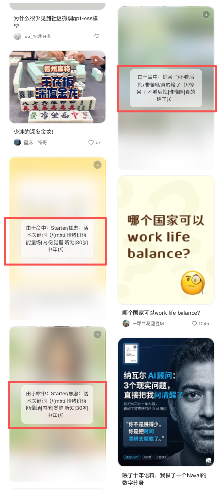
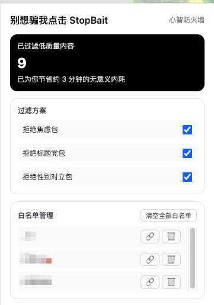

# 别想骗我点击 StopBait

说真的。  
刷小红书有时候不是放松，是内耗加速器。

“25岁存够一百万”。  
“这种男人真下头”。  
“避雷 / 惊呆了 / 你还不知道就晚了”。

点开。划走。再点开。  
一晚上过去，脑子像被人拧过。

我做这个插件，就是因为受够了这种感觉。

StopBait 不是“内容过滤器”这四个字。  
我更愿意叫它 **给注意力的保险**。  
或者更直白一点：**心智保镖**。

---

## 拦截效果

垃圾标题不会直接消失。  
它会被一层毛玻璃盖住。看得见轮廓，但不再骚扰你。

那种“干净了”的感觉很明显。  
像房间里一直嗡嗡响的噪音，突然被关掉。

---

## 控制面板

插件面板我尽量做得简单：  
打开就能看到过滤了多少条，省了多少时间。

规则不用学正则。  
你想屏蔽什么，直接打字。  
比如 `大厂 裸辞`，空格隔开就行。  
意思就是：这两个词同时出现就拦。

白名单也做了。  
你信任的作者点一下 `❤️ 信任`，立刻放行。  
在面板里还能一键回到 ta 的主页，或者移除。

---

## 隐私这件事

**代码开源，数据只在浏览器里，我不会收集你的信息。**

---

把刷手机的主动权，慢慢拿回来。  
从下一次“差点又点进去”的那一秒开始。

---

## 如何开始使用

Chrome 商店还在审核，审核通过后可以直接在 chrome 商店安装此插件。  
现在建议直接上「极客内测版」，一步一步来就行：

1. 前往 [Releases 页面](https://github.com/MachineGunLin/StopBait/releases/tag/v1.0.0)
2. 下载最新版 `StopBait-v1.0.0-Chrome.zip`。
3. 解压压缩包，你会看到一个 `dist` 文件夹。
4. 打开 Chrome，在地址栏输入 `chrome://extensions/`。
5. 开启右上角的「开发者模式」。
6. 点击左上角的「加载已解压的扩展程序」，选择刚才那个 `dist` 文件夹。

---

## 未来计划（TODO）

- [ ] 适配 知乎
- [ ] 适配 B站 (Bilibili)
- [ ] 适配 X (Twitter)
- [ ] 适配 YouTube

---

## 联系与反馈

这个插件完全免费，100% 不收集个人信息，我只是单纯反感标题党。

如果你有想支持的网站，或者想加的功能，欢迎直接来聊：[树哥的思考](https://www.xiaohongshu.com/user/profile/67fbe0ba000000000d00a703)
